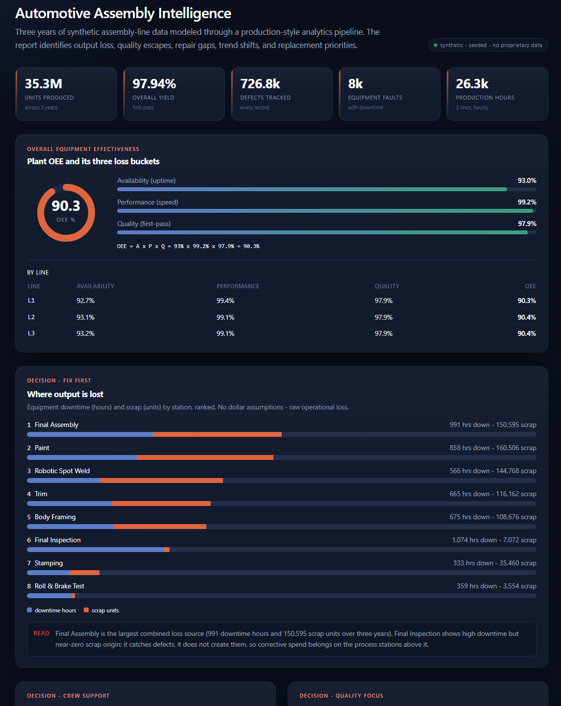
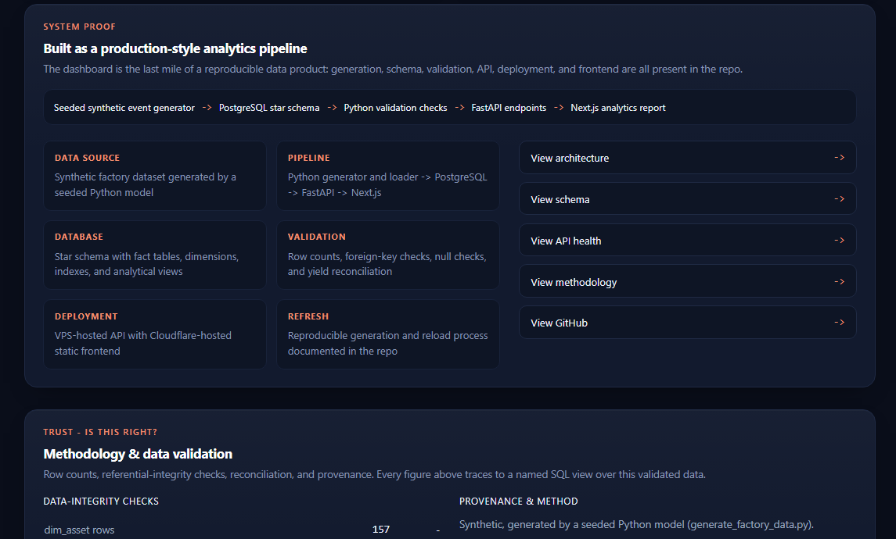
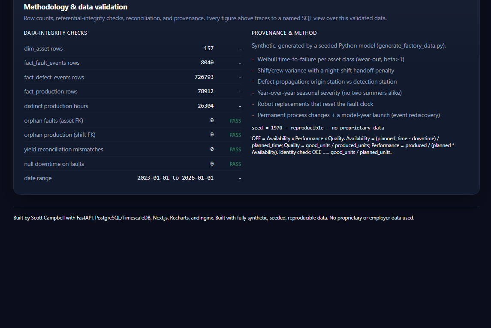
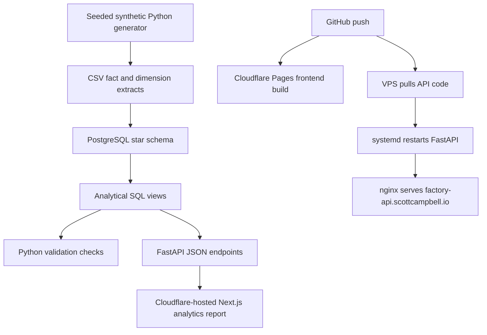

# Automotive Assembly Intelligence Platform

A production-style manufacturing analytics platform for an automotive final-assembly plant.

This project combines a domain-realistic synthetic dataset, a PostgreSQL star schema, analytical SQL views, a FastAPI backend, and a live Next.js executive dashboard. It was built to demonstrate full-stack data engineering, operational analytics, and BI delivery.

**No proprietary or employer data is used. The dataset is fully synthetic and reproducible from a seeded generator.**

* Live report: https://factory.scottcampbell.io
* Live API: https://factory-api.scottcampbell.io
* API docs: https://factory-api.scottcampbell.io/docs

## Screenshots

### Executive report



### System proof



### Methodology and validation



## Reviewer path

If you are reviewing this project quickly:

1. Open the live dashboard: https://factory.scottcampbell.io
2. Check the System Proof section.
3. Open the API health endpoint: https://factory-api.scottcampbell.io/health
4. Open the system endpoint: https://factory-api.scottcampbell.io/api/system
5. Review `db/schema.sql` and `db/analytical_views.sql`.
6. Review `generator/generate_factory_data.py`.
7. Review `docs/schema.md`.
8. Review `deploy/RUNBOOK.md`.

## What it shows

### The invisible night shift

Night-crew repair time runs about 30 percent longer than the best day crew, with a spike in the 4-5 a.m. handoff window. This is the kind of loss that hides in daily totals and only appears when the data is analyzed at the shift and crew grain.

### Detection versus origin

About 69 percent of defects are caught downstream of where they were created -- most of them at Final Inspection -- but they originate upstream at process stations such as Robotic Spot Weld, Paint, and Final Assembly. The model separates where defects are created from where they are detected.

### Event rediscovery

The trend layer independently surfaces operational events from the fact tables:

* Weld-cell retooling, with spot-weld defects down about 43 percent
* Supplier fastener bad batch
* Paint-booth upgrade
* Preventive-maintenance program, with mechanical faults stepping down after the start date

These events are not manually labeled in the trend chart. They are validated against a ground-truth events table.

### Reliability decomposition

The platform separates aging equipment effects, replacement resets, seasonal severity, fault type, crew variance, and station-level production impact.

## Architecture



```text
Seeded synthetic generator
        |
        v
CSV fact and dimension extracts
        |
        v
PostgreSQL star schema and analytical SQL views
        |
        v
Python validation checks and COPY loader
        |
        v
FastAPI JSON endpoints on a VPS
        |
        v
Cloudflare-hosted Next.js analytics report
```

Data flow:

```text
generator -> CSVs -> PostgreSQL -> analytical views -> FastAPI -> Next.js report
```

## Repository layout

```text
generator/   Seeded Python generator for a 3-year synthetic factory dataset
db/          Star schema, analytical views, and COPY loader
backend/     FastAPI service that exposes SQL views as JSON
frontend/    Next.js and Recharts analytics report
deploy/      systemd unit, nginx config, VPS runbook, and DB reset helper
docs/        screenshots, schema documentation, and reviewer-oriented proof
tests/       pytest validation suite for generator, database, and API contracts
.github/     CI workflow that runs tests against PostgreSQL and builds frontend
```

## System proof

| Area        | Implementation                                                                    |
| ----------- | --------------------------------------------------------------------------------- |
| Data source | Synthetic factory dataset generated by a seeded Python model                      |
| Pipeline    | Python generator and loader -> PostgreSQL -> FastAPI -> Next.js                   |
| Database    | Star schema with fact tables, dimension tables, indexes, and analytical views     |
| Validation  | Row counts, foreign-key checks, null checks, and yield reconciliation             |
| Deployment  | API on a Linux VPS behind nginx and TLS, frontend on Cloudflare Pages             |
| Refresh     | Reproducible data generation and reload process documented in `deploy/RUNBOOK.md` |

## Station flow

```text
ST01 Stamping
ST02 Body Framing
ST03 Robotic Spot Weld
ST04 Paint
ST05 Trim
ST06 Final Assembly
ST07 Final Inspection
ST08 Roll & Brake Test
```

Equipment is modeled as weld guns, paint robots, nut runners, handling robots, skillet conveyors, EMS carriers, AGVs, and lift/turntables.

Defects include weld splatter, dimensional out-of-spec, paint runs, torque out-of-spec, water leaks, gap and flush issues, squeak and rattle, and final-inspection findings. Defects originate at process stations and may be detected downstream.

## Quick start

### 1. Generate synthetic data

```bash
cd generator
pip install numpy pandas
python generate_factory_data.py
```

### 2. Create and load the database

```bash
createdb manufacturing
export DATABASE_URL=postgresql://localhost:5432/manufacturing

psql "$DATABASE_URL" -f db/schema.sql

pip install psycopg2-binary
python db/load_data.py

psql "$DATABASE_URL" -f db/analytical_views.sql
```

### 3. Run the backend

```bash
cd backend
python -m venv .venv
.venv/bin/pip install -r requirements.txt

DATABASE_URL="$DATABASE_URL" .venv/bin/uvicorn app.main:app --port 8000
```

### 4. Run the frontend

Open a new shell:

```bash
cd frontend
npm install
npm run dev
```

Local frontend:

```text
http://localhost:3000
```

Full VPS deployment with systemd, nginx, and TLS is documented in:

```text
deploy/RUNBOOK.md
```

Schema documentation:

```text
docs/schema.md
```

## API endpoints

### Health and methodology

```text
GET /health
GET /api/system
GET /api/methodology
GET /api/methodology/validation
GET /api/methodology/provenance
```

Example system response:

```json
{
  "status": "ok",
  "service": "factory-api",
  "database": "connected",
  "schema_version": "2026.06.27",
  "dataset_seed": 1970,
  "db": true,
  "date_min": "2023-01-01",
  "date_max": "2026-01-01",
  "tables": {
    "dim_station": 8,
    "dim_asset": 157,
    "fact_fault_events": 8088,
    "fact_defect_events": 725519,
    "fact_production": 78912
  }
}
```

### Executive analytics

```text
GET /api/kpi
GET /api/exec/oee
GET /api/exec/oee/by-line
GET /api/exec/loss/by-station
```

### Operational analytics

```text
GET /api/shifts/mttr-by-crew
GET /api/shifts/handoff
GET /api/quality/root-cause
GET /api/quality/propagation
GET /api/reliability/replace-candidates
GET /api/reliability/summer-thermal
GET /api/trends/yield-by-quarter
GET /api/trends/events
```

## Validation checks

The methodology endpoint and `v_validation` SQL view expose the data quality checks used by the report:

* Row counts for dimensions and fact tables
* Orphan fault checks against `dim_asset`
* Orphan production rows against `dim_shift_calendar`
* Yield reconciliation mismatches
* Null downtime checks
* Date range checks
* Production-hour checks

Example:

```bash
curl https://factory-api.scottcampbell.io/api/methodology/validation
```

## Automated tests and CI

The repository includes a pytest suite under `tests/`:

```text
tests/test_generator_reproducibility.py
tests/test_row_counts.py
tests/test_foreign_keys.py
tests/test_api_contracts.py
tests/test_validation_endpoint.py
```

The tests regenerate the synthetic dataset, load PostgreSQL, apply analytical
views, and verify:

* deterministic row counts from the seeded generator
* no orphan asset IDs
* no orphan shift links
* no negative production values or invalid yield values
* expected API JSON keys
* `/api/methodology/validation` reports PASS for integrity checks
* `/docs` and `/openapi.json` are available

GitHub Actions runs backend tests against PostgreSQL and builds the Cloudflare
frontend on every push and pull request.

Run locally:

```bash
pip install -r backend/requirements.txt pytest psycopg2-binary numpy pandas httpx
export DATABASE_URL=postgresql://localhost:5432/manufacturing
pytest -q
```

## Deployment model

The frontend is a static Next.js export deployed from GitHub by Cloudflare Pages.

Cloudflare Pages settings:

```text
Root directory: frontend
Build command: npm run build
Build output directory: out
NEXT_PUBLIC_API_BASE=https://factory-api.scottcampbell.io
```

The API runs separately on a VPS:

```text
factory-api.scottcampbell.io -> nginx -> 127.0.0.1:8002 -> FastAPI -> PostgreSQL
```

## Data provenance

The dataset is synthetic and modeled on general reliability-engineering and assembly-operations principles:

* Weibull-style failure behavior
* Shift and crew variance
* Defect propagation from origin to detection
* Year-over-year seasonal severity
* Robot replacement resets
* Process-change events
* Model-year launch effects

The generator is seeded with `SEED = 1970`, so rerunning the generator reproduces the same dataset.

See:

```text
generator/generate_factory_data.py
```

## Stack

* Python
* pandas
* numpy
* PostgreSQL
* FastAPI
* asyncpg
* Next.js 14
* TypeScript
* Recharts
* nginx
* systemd
* Cloudflare Pages

## Known limitations

* This is a portfolio demonstration, not a production plant system.
* The dataset is synthetic and intentionally excludes proprietary or employer data.
* The model focuses on operational analytics and decision support, not AI or real-time machine control.
* Schema reloads are acceptable for this seeded demo. A live production system would use migrations, retention policies, access control, and environment-specific deployment gates.
