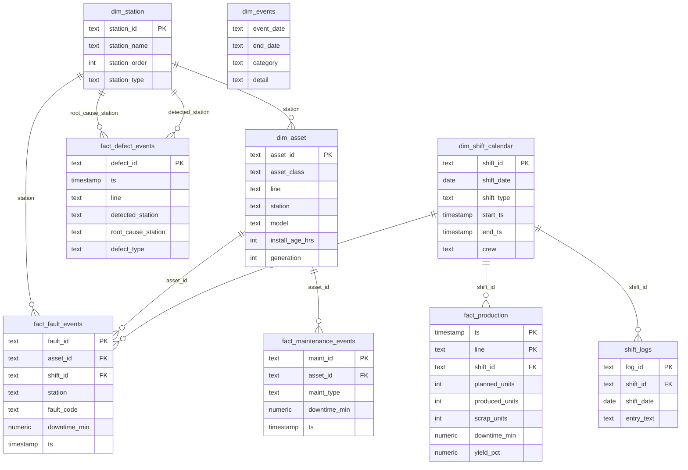

# Schema Documentation

This database uses a compact star schema for a synthetic automotive final-assembly
analytics system. The physical schema is intentionally small enough to audit, but
wide enough to support OEE, loss analysis, crew/shift analysis, defect flow, and
replacement planning.

## Entity Relationship Diagram

## Tables

### `dim_station`

Purpose: station dimension for the eight assembly stations, in physical process
order.

Primary key: `station_id`

Important columns:

- `station_name`: human-readable name, such as `Robotic Spot Weld`
- `station_order`: physical position in the line (0-based), used to reason about
  upstream/downstream defect flow
- `station_type`: `process` (creates defects) or `inspection` (detects them)

Relationships:

- Referenced by `dim_asset.station`
- Referenced by `fact_fault_events.station`
- Referenced by `fact_defect_events.root_cause_station`
- Referenced by `fact_defect_events.detected_station`

Dashboard sections:

- Loss by station
- Defect origin vs detection

### `dim_asset`

Purpose: asset dimension for robots and conveyor segments.

Primary key: `asset_id`

Important columns:

- `asset_class`: `robot` or `conveyor`
- `line`: assembly line
- `station`: station code, such as `ST03`
- `model`: synthetic equipment model
- `generation`: increments when replacement resets the asset clock

Relationships:

- Referenced by `fact_fault_events.asset_id`
- Referenced by `fact_maintenance_events.asset_id`

Indexes:

- primary-key index on `asset_id`

Dashboard sections:

- Robots to budget for replacement
- Worst-performing assets
- Loss by station
- Reliability decomposition

### `dim_shift_calendar`

Purpose: shift, crew, and time-window dimension.

Primary key: `shift_id`

Important columns:

- `shift_date`
- `shift_type`: day or night
- `start_ts`, `end_ts`
- `crew`

Relationships:

- Referenced by `fact_production.shift_id`
- Referenced by `fact_fault_events.shift_id`
- Referenced by `shift_logs.shift_id`

Dashboard sections:

- The invisible night shift
- Crew repair-time comparison
- Shift handoff penalty

### `dim_events`

Purpose: ground-truth operational event log used to validate whether the trend
layer can rediscover known synthetic events from the fact tables.

Primary key: none; this is a small event-log dimension.

Important columns:

- `event_date`
- `end_date`
- `category`
- `detail`

Dashboard sections:

- Quality trend rediscovers operational events
- Methodology and provenance

### `fact_production`

Purpose: hourly production by line.

Primary key: `(ts, line)`

Important columns:

- `planned_units`
- `produced_units`
- `scrap_units`
- `downtime_min`
- `yield_pct`

Relationships:

- `shift_id` references `dim_shift_calendar.shift_id`

Dashboard sections:

- KPI cards
- OEE
- Yield trend
- Validation reconciliation

### `fact_fault_events`

Purpose: every equipment fault event with asset, station, crew, and downtime.

Primary key: `fault_id`

Important columns:

- `asset_id`
- `shift_id`
- `fault_code`
- `fault_desc`
- `downtime_min`
- `ts`

Relationships:

- `asset_id` references `dim_asset.asset_id`
- `shift_id` references `dim_shift_calendar.shift_id`
- `station` references `dim_station.station_id`

Indexes:

- `idx_fault_asset`
- `idx_fault_ts`
- `idx_fault_code`

Dashboard sections:

- MTTR by crew
- Shift handoff
- Summer thermal faults
- Robot replacement candidates
- Loss by station

### `fact_maintenance_events`

Purpose: preventive maintenance and replacement history.

Primary key: `maint_id`

Important columns:

- `asset_id`
- `maint_type`: preventive or replacement
- `detail`
- `downtime_min`
- `ts`

Relationships:

- `asset_id` references `dim_asset.asset_id`

Indexes:

- `idx_maint_asset`

Dashboard sections:

- Replacement resets
- Reliability decomposition

### `fact_defect_events`

Purpose: full-fidelity defect events with origin and detection station.

Primary key: `defect_id`

Important columns:

- `detected_station`
- `root_cause_station`
- `crew`
- `shift_type`
- `defect_type`
- `ts`

Relationships:

- `root_cause_station` references `dim_station.station_id`
- `detected_station` references `dim_station.station_id`

Indexes:

- `idx_defect_root`
- `idx_defect_ts`
- `idx_defect_det`

Dashboard sections:

- Defect origin vs detection
- Defect propagation
- Loss by station
- Quality trend

### `shift_logs`

Purpose: messy synthetic technician log entries for context and future NLP-style
exploration. The current dashboard does not depend on these logs.

Primary key: `log_id`

Relationships:

- `shift_id` references `dim_shift_calendar.shift_id`

## Station, Quality, And Process Modeling Notes

The physical schema includes `dim_station` but intentionally omits separate
`fact_quality_events` or `fact_process_events` tables.

- Station codes (`station`, `detected_station`, `root_cause_station`) are
  foreign keys into `dim_station`, so every code is guaranteed to resolve to a
  named station with a known process/inspection type and line position.
- Quality events are modeled as individual rows in `fact_defect_events`.
- Process events are modeled in `dim_events` and validated through analytical
  views such as `v_yield_by_quarter`, `v_defects_monthly`, and event-specific
  monthly defect views.

This keeps the demo schema direct while still supporting origin/detection,
event rediscovery, OEE, replacement planning, and validation checks.

## Analytical Views

The dashboard reads SQL views instead of raw tables. Important views include:

- `v_kpi_overall`
- `v_oee`
- `v_oee_by_line`
- `v_loss_by_station`
- `v_mttr_by_crew`
- `v_shift_handoff_effect`
- `v_rootcause_ranking`
- `v_propagation`
- `v_robot_candidates`
- `v_summer_thermal`
- `v_yield_by_quarter`
- `v_validation`
